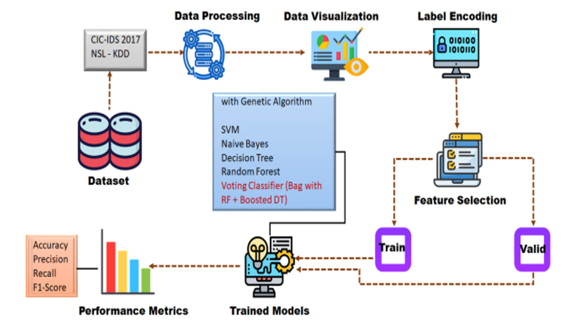
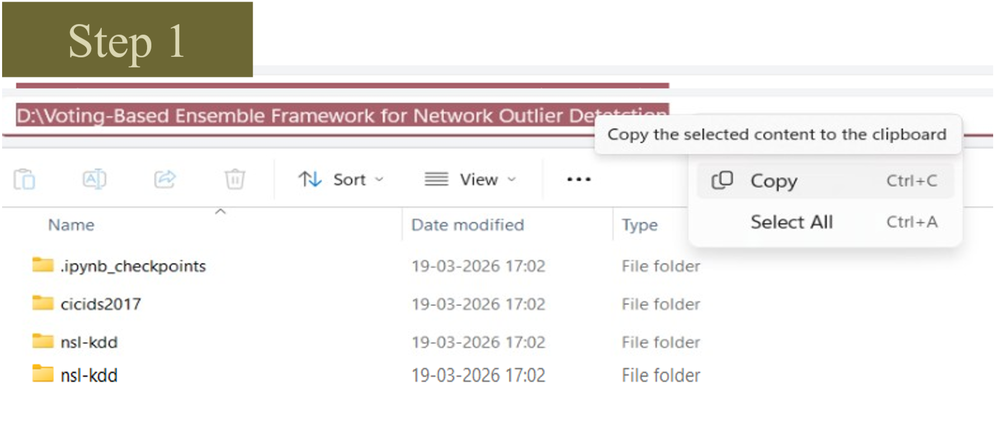
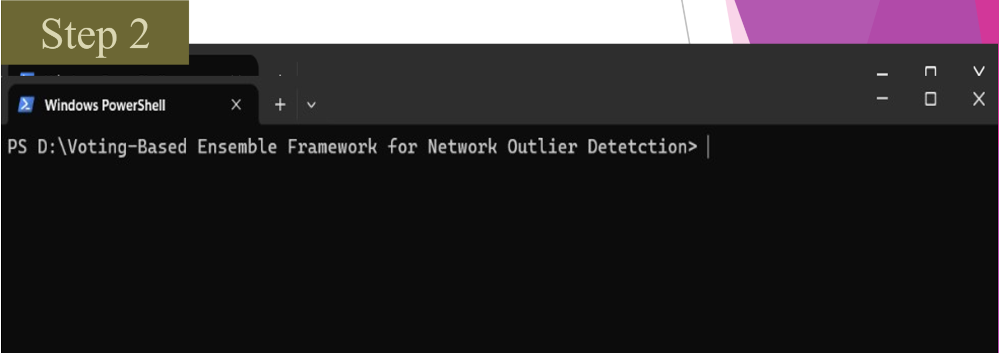
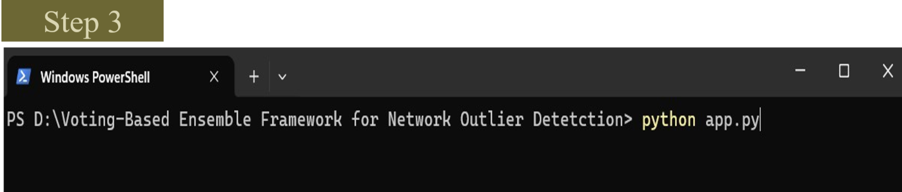
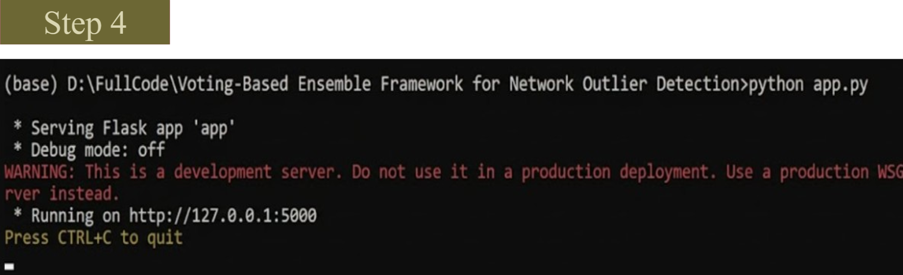
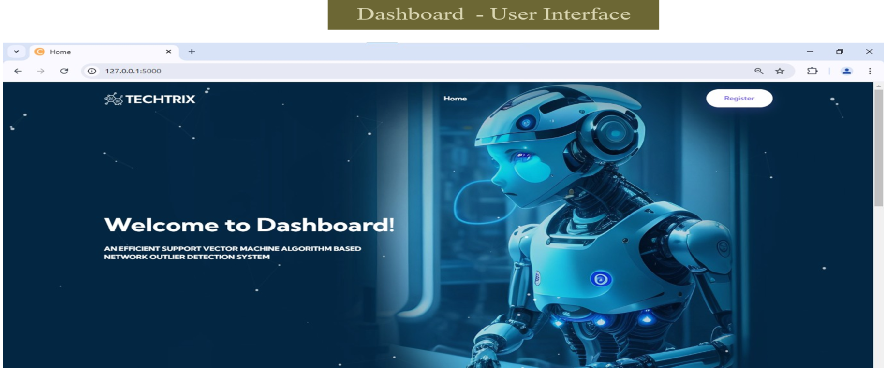
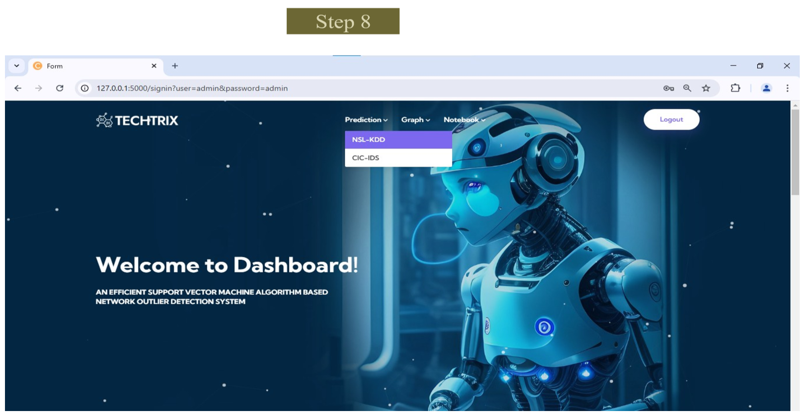
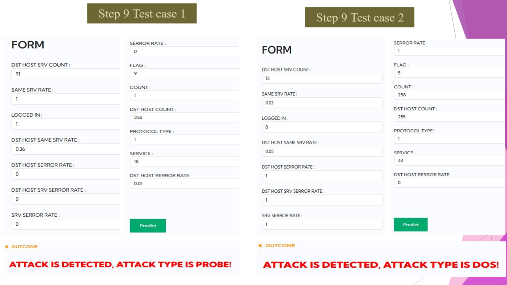
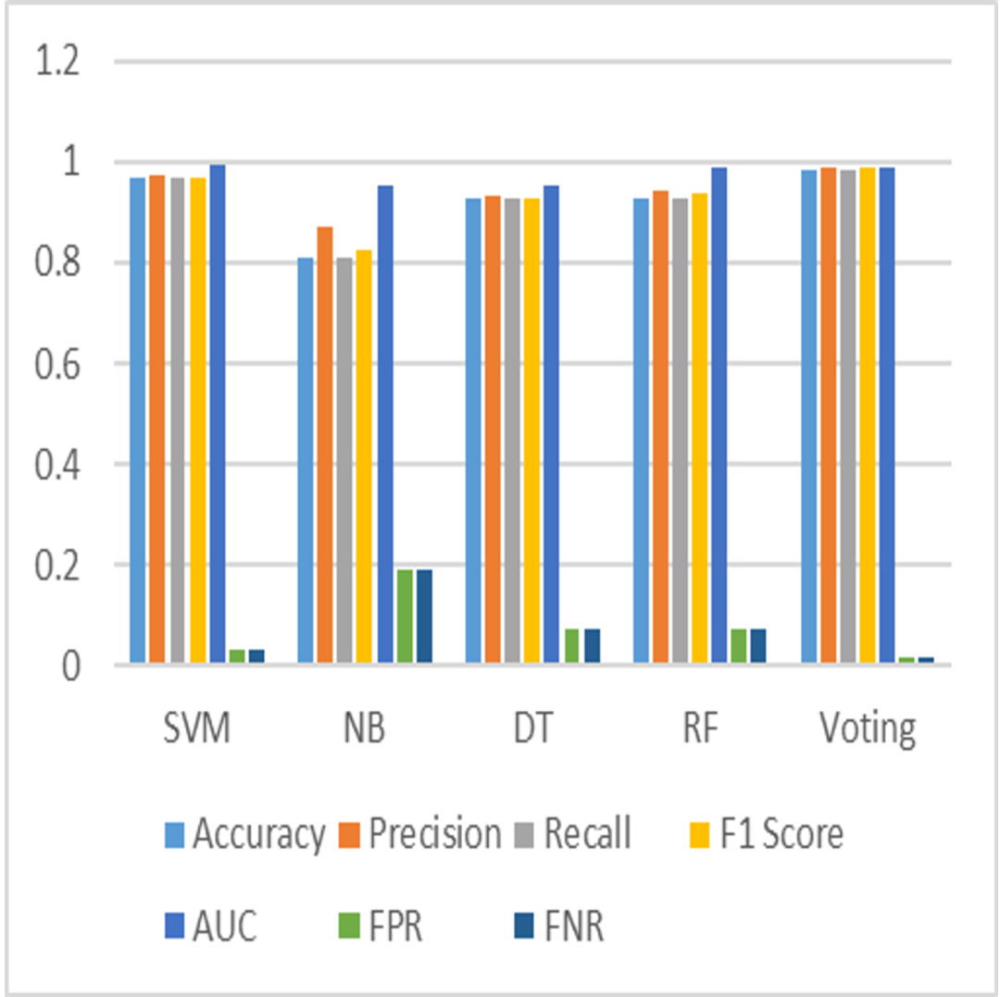
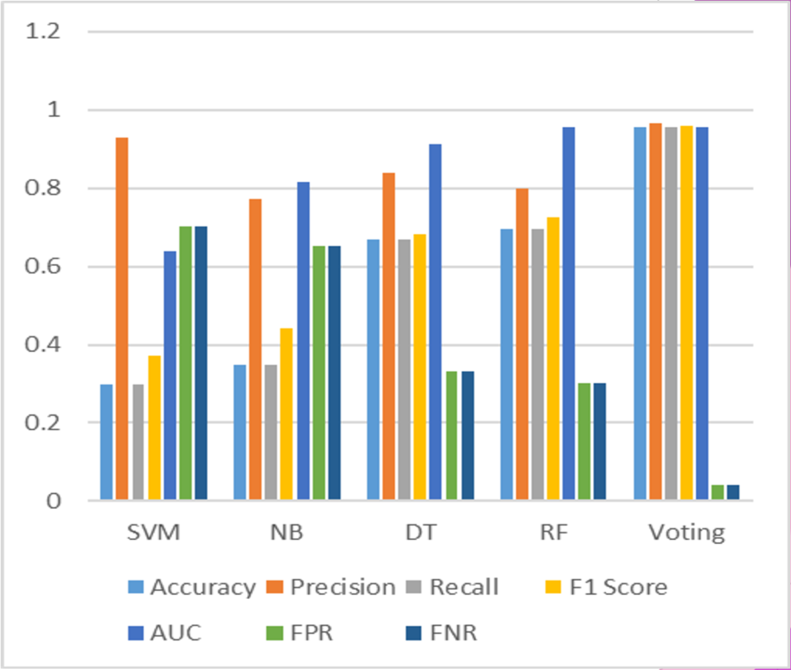

# Voting-Based Ensemble Framework for Network Outlier Detection

A machine-learning-based network intrusion and outlier detection system that classifies network traffic using the **NSL-KDD** and **CIC-IDS-2017** datasets.

The project uses multiple classification algorithms and a voting-based ensemble approach to identify normal traffic and cyberattack categories through a Flask web application.

## Project Overview

Network attacks are increasing in scale and complexity, making early and accurate intrusion detection essential. This project processes network traffic data, applies preprocessing and feature-selection techniques, trains multiple machine-learning models, and combines predictions through ensemble voting.

The application allows users to enter network-related feature values and obtain a predicted network traffic category.

## Key Features

- Network outlier and intrusion detection
- Support for NSL-KDD and CIC-IDS-2017 datasets
- Flask-based user interface
- User registration and login module
- OTP-based registration verification
- Machine-learning classification models
- Voting-based ensemble framework
- Performance evaluation using Accuracy, Precision, Recall, F1-Score, AUC, FPR, and FNR
- Jupyter notebooks for model training and analysis

## System Workflow

The following workflow illustrates the project pipeline, from dataset preprocessing through model training, ensemble voting, and performance evaluation.



## Machine-Learning Models

The project evaluates and combines predictions from the following classifiers:

- Support Vector Machine (SVM)
- Naive Bayes (NB)
- Decision Tree (DT)
- Random Forest (RF)
- Voting Classifier

## Supported Datasets

### NSL-KDD

The NSL-KDD dataset is used to classify network traffic into the following categories:

- Normal
- Denial of Service (DoS)
- Probe
- Remote to Local (R2L)
- User to Root (U2R)

### CIC-IDS-2017

The CIC-IDS-2017 dataset is used to identify traffic categories such as:

- Benign
- Botnet
- Brute Force
- DDoS
- DoS
- Infiltration
- PortScan
- Web Attack

## Technologies Used

- Python
- Flask
- NumPy
- Pandas
- Scikit-learn
- Joblib
- SQLite
- Jupyter Notebook
- HTML, CSS, JavaScript
- Bootstrap

## Project Structure

```text
.
├── 1.Documentation/
│   └── Voting-Based Ensemble Framework for NOD.docx
├── 2.Research_Paper/
│   └── Voting-Based Ensemble Framework for NOD_Paper.docx
├── 3.Source_Code/
│   └── Voting-Based Ensemble Framework For Network Outlier Detection/
│       ├── app.py
│       ├── requirements.txt
│       ├── CIC-IDS-2017.ipynb
│       ├── NSL-KDD.ipynb
│       ├── model_clf_cic.sav
│       ├── model_clf_nsl.sav
│       ├── model_pca_cic.sav
│       ├── model_pca_nsl.sav
│       ├── signup.db
│       ├── cicids2017/
│       ├── nsl-kdd/
│       ├── static/
│       └── templates/
├── 4.Software_Requirements/
│   └── requirements.txt
├── 5.Execution_Steps/
│   └── Steps_To_Run_Project.txt
└── docs/
    └── images/
```

## Installation

### 1. Clone the repository

```bash
git clone https://github.com/<your-username>/<your-repository-name>.git
cd <your-repository-name>
```

### 2. Navigate to the source-code directory

```bash
cd "3.Source_Code/Voting-Based Ensemble Framework For Network Outlier Detection"
```

### 3. Create a virtual environment

```bash
python -m venv .venv
```

Windows:

```bash
.venv\Scripts\activate
```

macOS/Linux:

```bash
source .venv/bin/activate
```

### 4. Install dependencies

```bash
pip install -r requirements.txt
```

## Run the Application

Start the Flask application from the source-code directory:

```bash
python app.py
```

After the server starts, open the application in your browser:

```text
http://127.0.0.1:5000/
```

## Application Execution

### Step 1 — Open the project folder



### Step 2 — Open PowerShell or a terminal in the project directory



### Step 3 — Run the Flask application

```bash
python app.py
```



### Step 4 — Confirm that the Flask server is running

The application runs locally at `http://127.0.0.1:5000/`.



## Application Screenshots

### Dashboard User Interface



### Dataset Selection

Users can select either the NSL-KDD or CIC-IDS dataset for prediction.



### Prediction Test Cases

The following test cases demonstrate successful attack predictions from the input network features.

- Test Case 1: Probe attack detected
- Test Case 2: DoS attack detected



## Performance Results

### NSL-KDD Dataset Results

The comparison below evaluates SVM, Naive Bayes, Decision Tree, Random Forest, and the Voting Classifier using Accuracy, Precision, Recall, F1-Score, AUC, FPR, and FNR.



### CIC-IDS-2017 Dataset Results

The following graph presents the model-performance comparison for the CIC-IDS-2017 dataset.



## Model Training

The project includes the following Jupyter notebooks for data preprocessing, training, testing, and model evaluation:

```text
CIC-IDS-2017.ipynb
NSL-KDD.ipynb
```

To launch Jupyter Notebook:

```bash
jupyter notebook
```

Open the notebooks and run the cells in sequence after installing the project dependencies.

## Pre-trained Models

The application includes serialized machine-learning model files:

```text
model_clf_nsl.sav
model_clf_cic.sav
model_pca_nsl.sav
model_pca_cic.sav
```

## Security Notes

Before deploying this project publicly, the following improvements are recommended:

- Store email credentials and sensitive values in environment variables.
- Never include passwords, OTP credentials, or API keys in source code.
- Hash user passwords before storing them in the database.
- Use `POST` requests for registration and login.
- Add OTP expiration, attempt limits, and session-based user handling.

## Conference Presentation Certificate

This project, **Voting-Based Ensemble Framework for Network Outlier Detection**, was presented at the **14th International Conference on Contemporary Engineering and Technology (ICCET 2026)**.


## License

This project is intended for academic and educational purposes. Add a license file before public distribution or commercial reuse.
